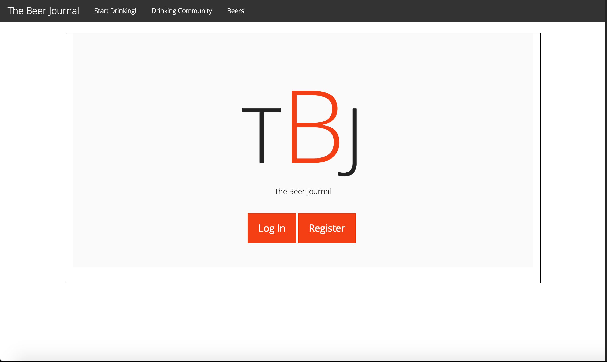
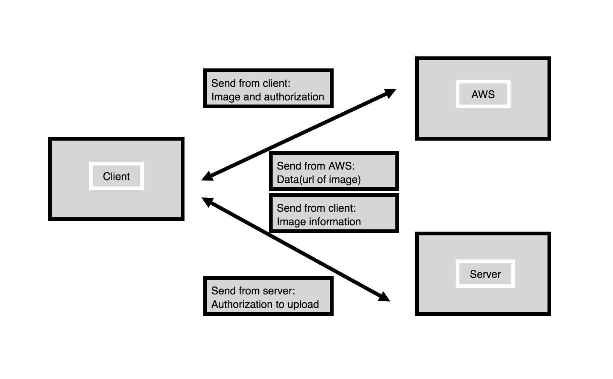

# The Beer Log

### A MEAN stack application where a user can log, review and share beers they have drunk.

Users can create and login in to the web app and create and see beers that they have drunk.

## To use the app

Visit [The Beer Journal ](http://tbj.garrettestrin.com/ ) to use the app as a user.

Visit [The Beer Journal GitHub ](https://github.com/GarrettEstrin/beer_web) to download the app to your local machine.

This app was built with Node.js.

### Local installation instructions

Download the repository to your preferred directory.

 Create a .env file in the root of the project.

 Add this key/value pair: MONGO_URL={link to your mongo database}

 Start a MongoDB local database if not using a remote database.

 From the terminal and in your installation directory run

 `npm install`

 to install the dependent packages.

 Start the server by running the command

 `nodemon`

 in the terminal from your installation directory.

 [localhost:3000 ](localhost:3000)

 to use the site locally.

### Development process

Technologies used: MongDB, Node.js/Express, Angular, HTML, CSS, JavaScript

## User Stories

As a user, I can register a new account with minimal information.

As a user, I can login and be directed to the profile page.

As a user, I can change my avatar.

As a user, I can log a new beer.

As a user, I can view beers that have been logged by other users.

As a user, I can logout out of the website from the navigation bar.

## Future implementations

* Upload a picture of beer.

* Add current location to beer through Google Maps API.

* Have users comment on beers.

* Fix hamburger on mobile navbar.

## Feature Wish List

* Ionic app.

## Special Thanks to:

* Philippe for pretending to believe me everytime I said I "had a quick question".

* Jimmy for a mind opening converstation about Angular and data.

* Everyone in the class for always being available to bounce ideas and thoughts off of.
